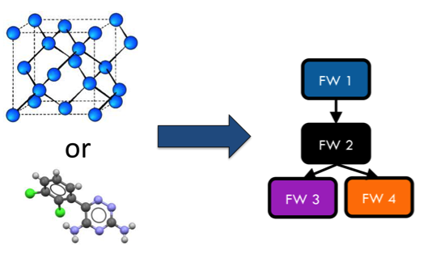
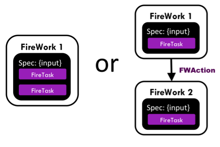
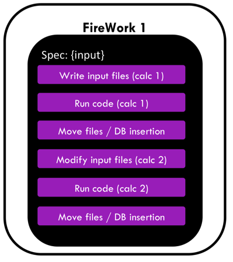
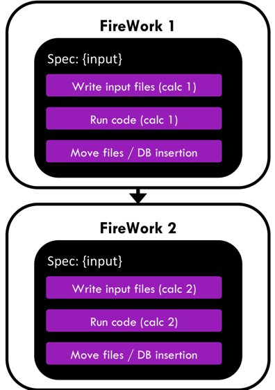
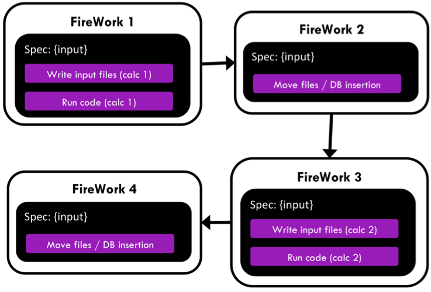
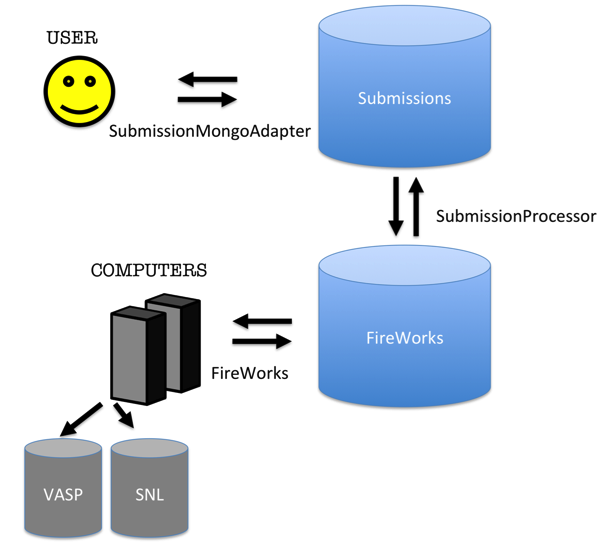

=======
MPWorks
=======

MPWorks merges pymatgen, custodian, and FireWorks into a custom workflow for Materials Project. It is very powerful in that it is used for all the calculations performed for the Materials Project database; however, it is also quite complicated and not completely flexible. This guide will try to explain the operation of the MPWorks system of running calculations

0. Installation
===============

MPWorks is in essence a system of running calculations. Thus, in addition to the code you need to have several MongoDB databases and environment variables set. The easiest way to install all of this is to use (or modify) `the MPenv code <https://github.com/materialsproject/MPenv>`_, which will install all the necessary dependencies of MPWorks, build the appropriate databases, and set the environment variables. Unfortunately, MPenv only works on a few systems such as NERSC and (soon) ALCF.

There are also some example workflows in MPWorks that can be attempted with much less complication. This guide will also cover those, but you will still need to learn the fundamentals and will still need a FireWorks database. It is important to note that MPWorks is not intended to be a "general purpose" code at this time, and is mainly used internally by the Materials Project team.

1. Introduction and Pre-requisites
==================================

This document is a guide for designing and running materials science and chemistry workflows using the Materials Project codebases (pymatgen, FireWorks, custodian, etc.) and NERSC resources.

The advantage of learning the infrastructure is that once you gain familiarity, you will be able to very easily run and manage your calculations. If you need to perform a set of computations over a new compound, you will simply need to execute a command rather than editing input files, ssh’ing them to NERSC, running qsub, etc…This is crucial when running hundreds of thousands of jobs, but you’ll probably find it very nice to have in your day-to-day work as well. Whenever you want to compute a new structure, you can do it in almost no time.

In addition, the infrastructure is meant to help you rigorously test your workflows over test sets of compounds and rapidly analyze the results.

However, before taking advantage of this infrastructure you must take a little time to learn it. In particular, there are many components to making the Materials Project high-throughput project function and you will need to learn at least a bit about all of them:

* The **pymatgen** codebase (http://pymatgen.org) is used to read and write input and output files for various computational codes (like VASP or NWChem) given arbitrary structures and for different computational types (like static or structure optimization). The **pymatgen-db** codebase (http://pythonhosted.org/pymatgen-db/) is used to parse output files.
* The **custodian** codebase (http://pythonhosted.org/custodian/) is used to execute the desired code in a way that can fix most errors that might be encountered during the run
* The **FireWorks** codebase (http://pythonhosted.org/FireWorks/) allows us to automically run and track many thousands of jobs (such as custodian jobs) over supercomputing resources. FireWorks can also fix more complicated errors that may arise (like server crashes) and help design dynamic workflows.

This documentation focuses on how these codebases work together and is *not* intended to teach you how to use the codebases individually. Before starting, it is therefore crucial that you review and have a basic understanding of each codebase in isolation, so things will make sense when we start putting things together.

1.1 FireWorks prerequisites
---------------------------

.. pull-quote:: | FireWorks documentation can be found at http://pythonhosted.org/FireWorks/

Before starting this documentation, make sure you have read through all the documentation on FireWorks and have a basic understanding of at least the following tutorials:

* Quickstart
* Defining Jobs using FireTasks
* Creating Workflows
* Dynamic Workflows
* Tips for designing FireTasks, FireWorks, and Workflows

This documentation assumes that you have at least a basic grasp of the concepts of those tutorials. If you are interested in not only designing and submitting workflows, but running testing or production jobs at NERSC, you should also review the following FireWorks documentation (you should read the tutorials, but you don’t have to actually follow the instructions to install anything at NERSC; remember, MPEnv will do that for you):

* Worker Tutorial
* Launch Rockets through a queue
* Reserving FireWorks upon queue submission
* Installation Notes on various clusters / supercomputing centers

1.2 custodian prerequisites
---------------------------

.. pull-quote:: | custodian documentation can be found at http://pythonhosted.org/custodian/

Additionally, you should read all the documentation on custodian (it is a single page)

1.3	pymatgen and pymatgen-db prerequisites

.. pull-quote:: | pymatgen documentation can be found at http://pythonhosted.org/pymatgen/
.. pull-quote:: | pymatgen db documentation is at http://pythonhosted.org/pymatgen-db/

Before starting this documentation, you should have enough familiarity with pymatgen to:

* write input files for the code you want to execute (e.g., VASP or NWChem) and
* parse output files for the code you want to execute into a MongoDB (JSON) format

For the latter functionality, you might need to consult the pymatgen-db codebase.

1.4 Other prerequisites
-----------------------

You should have the **MPWorks** codebase downloaded (so you can see the
source code), e.g. through MPenv at NERSC. We’ll be referring to source
code in MPWorks during the course of this guide, so it’s important you
have it available.

2. Designing Scientific Workflows for running at NERSC
======================================================

2.1 How workflow design fits in
-------------------------------

If you recall the FireWorks documentation, there are essentially two steps to running scientific workflows at NERSC (Figure 1):

.. image:: mpworks/docs/a.png

**Figure 1 FireWorks operation**

The steps are:

1. Defining Workflows in FireWorks format and putting them in the
   “LaunchPad” (a MongoDB database that is hosted “somewhere”)

2. Running Workflows on NERSC (a FireWorker) by pulling jobs from the
   LaunchPad

This section concentrates only on part 1 – defining workflows and
putting them in the LaunchPad. This part does not actually require
logging into a NERSC machine and can be done from your laptop at home.
Running jobs will be covered later on.

2.2 Designing Workflows for Materials Science
---------------------------------------------

The goal of this section is to explain how, given any crystal or
molecule, one might construct a FireWorks Workflow for computing its
properties (Figure 2):

**Figure 2 Goal of this section – automatically create a FireWorks
workflow for any crystal or molecule**

Once we can write some code that will take any compound and construct a
workflow, automation is easy. Those workflows can be run very easily at
NERSC using the job execution features of FireWorks.

The issue then is how to write code that will take in a compound and
create a Workflow. If you recall the FireWorks documentation, a Workflow
is composed of multiple FireWorks, which are in turn composed of
multiple FireTasks. Each FireTask is meant to be an atomic “action”. In
our case, a single FireTask might:

-  write some input files for a code

-  execute code (e.g. VASP or NWChem), either directly in Python or
   within a **custodian**

-  move files around

-  parse some files and enter them in a database

-  decide whether more computations are needed and add them to the
   database if needed (using dynamic workflow features built into
   FireWorks)

By putting together multiple FireTasks and FireWorks, we’ll end up with
a Workflow that suits our needs. So we need to do two things:

-  write the code for each individual FireTask

-  meld them into an appropriate Workflow sequence, splitting some of
   them up into different FireWorks

Although these topics are somewhat related, we’ll try to cover some
examples of writing FireTasks first, and then move onto constructing
Workflows that tie them together.

2.3 Writing FireTasks: a few examples
-------------------------------------

It is somewhat difficult to create a guide for writing FireTasks – a
FireTask can really be arbitrary code. Therefore, we’ll just point to a
few case studies in the MPWorks and Rubicon codebases. These codebases
contain specific implementations of FireTasks for the Materials Project
and JCESR project, respectively. They depend on **pymatgen**,
**custodian**, and **FireWorks** in order to work.

Note that these FireTasks change from time to time, so use this as a
rough guide. Also, don’t worry about understanding every detail of these
FireTasks – just get a rough sense for what they’re doing and try to get
through this section with a basic understanding the first time. Ask an
MPWorks expert (e.g., Wei or Anubhav) when you really need to understand
the fine details.

**Important note:** Recall from the FireTasks documentation that the
*run\_task()* method of a FireTask is what gets executed. You should
concentrate on this method for each FireTask.

2.3.1 VaspWriterTask
~~~~~~~~~~~~~~~~~~~

    VaspWriterTask is located in
    **/mpworks/firetasks/vasp\_io\_tasks.py**

The VaspWriterTask is about as simple as it gets – it is just a few
lines of code. It reads information from the *fw\_spec* and uses that
information to write INCAR, KPOINTS, POSCAR, and POTCAR files to the
current directory. The expectation is that the next FireTask in the
sequence will run VASP.

More specifically, this task is reading in the “vasp” key of the
*fw\_spec* that was stored by the person creating the FireWork. This key
contains the information needed generate the input files. The format of
the “vasp” key is pymatgen dictionary representations of the INCAR,
POSCAR, etc objects. Given these dictionary objects, this FireTask will
write the input files.

Therefore, if you are trying to write some VASP input files, you can
just create a FireWork with the appropriate *spec* (a “vasp” key with
Pymatgen dictionary representations of input files) and then add the
*VaspWriterTask* as one of your FireTasks.

Note that you might wonder why the specification expects pymatgen
representations of these files, rather than just the raw String content.
Either would work; the pymatgen dictionary representations are much
easier to query and explore with MongoDB. For example, you can very
easily search for all the FireWorks where the INCAR parameter has NSW
set to 0, which is harder (and slower) to do via String matching over
the database.

2.3.2 VaspCustodianTask
~~~~~~~~~~~~~~~~~~~~~~~

    A simplified version of VaspCustodianTask (called
    VaspCustodianTaskEx) is located in
    **/mpworks/examples/firetasks\_ex.py.** The actual VaspCustodianTask
    is located in **/mpworks/firetasks/custodian\_task.py**. We will
    discuss the simple version.

The VaspCustodianTaskEx uses custodian to run an executable such as
VASP. It expects that all input files for VASP are already written in
the directory (e.g., via a VaspWriterTask). The job of
VaspCustodianTaskEx is to execute a **custodian** to call the VASP
executable.

This is the core code that loads a custodian and runs it::

   c = Custodian(self.handlers, self.jobs, self.max_errors)
   custodian_out = c.run()

You might notice that this code has nothing to do with VASP. The
parameters *self.handlers* and *self.jobs* contain **custodian** objects
that represent VASP jobs. The user passes these in via the FireTask’s
*parameters*. In the constructor for VaspCustodianTask, you’ll notice a
line of code that looks like this::

   self.jobs = map(VaspJob.from_dict, parameters['jobs'])

This is what is loading the Vasp Jobs based on the parameters of the
FireTask. To use VaspCustodianTaskEx, you must therefore create this
FireTask with the *job* and *handlers* parameters set to dictionary
representations of VaspJob and VasprunHandler objects from custodian.

There is some extra code in this task regarding a choice between “aprun”
and “mpirun” because the command to execute VASP depends on the machine
we are running on. But the core of this method is to load custodian Job
and Handler objects in the constructor, and then instantiate and run the
custodian in the run() method.

Note that another way to run VASP is to simply use the command::

   import subprocess
   subprocess.check_call([“vasp”])

inside the run() method, and do away with complicated constructors,
reading parameters like *job* or *handlers*, and make life simple.
However, if we did this we would not be able to use the error-correction
features of custodian.

2.3.3 VaspCopyTask
~~~~~~~~~~~~~~~~~~~

    VaspCopyTask is located in **/mpworks/firetasks/vasp\_io\_tasks.py**

The VaspCopyTask in MPWorks is also very simple. All it’s doing is
copying a bunch of files from some directory to the current directory.
This FireTask is used, for example, to copy output files from the
structure optimization run to the static run. The directory containing
the previous run must be defined in the FireWork specification under the
“prev\_vasp\_dir” key. Other than that, there are some options for
choosing what files to move and dealing with tricky things like
“.relax#” extensions to output files added by certain types of VASP
custodian runs.

2.3.4. VaspToDBTask
~~~~~~~~~~~~~~~~~~~~

    A simplified version of VaspToDBTask called VaspToDBTaskEx is
    located in **/mpworks/examples/firetasks\_ex.py.** The actual
    VaspToDBTask is located in
    **/mpworks/firetasks/vasp\_io\_tasks.py**. We will discuss the
    simple version first, then the more complex version.

The VASPtoDBTaskEx uses the pymatgen-db codebase to enter the output of
a VASP run into the database.

First, it loads the VASP output directory from the “prev\_dir”
parameter. Then, it instantiates a *VaspToDBTaskDrone* object which,
given database credentials, can parse the output directory and enter the
results into the database. The actual database insertion is done via the
command::

t_id = drone.assimilate(prev_dir)

At this point, we are largely done with the simplified VaspToDBTaskEx.

The more complex VaspToDBTask (without the Ex) uses MPVaspDrone and does
the following (feel free to skip these details if you’re just getting
started):

-  Before database insertion, this task is also moving files from
   NERSC’s **$SCRATCH** filesystem to NERSC’s **$PROJECT** filesystem
   (we refer to it as the “garden”). All runs need to be moved from
   SCRATCH to PROJECT after completion, due to limited space (but better
   disk performance) on SCRATCH.

-  After database insertion, there is a lot of complicated code
   determining whether this task should be rerun using a new Workflow
   step. Feel free to ignore this detail for the moment. Normally, this
   whole ordeal would be handled by **custodian** in a cleaner way.
   However, the limitation of **custodian** is that all job restarts
   occur within the same walltime at NERSC. If we have a 7-day walltime,
   and the job fails after 6.5 days, a **custodian**-based restart would
   only give the job’s reincarnation 0.5 days to complete. Most of the
   time, jobs fail early and it’s OK to use **custodian** and restart
   within the same walltime limit. However, some errors (like those
   detected by UnconvergedHandler) fail very late or at the end of the
   job, and they need to be wrapped in a new FireWork that will allow
   the reincarnation of the job to run with a brand new 7-day walltime.

2.3.4. Other MPWorks tasks, e.g. “Setup”-style tasks and Controller tasks
~~~~~~~~~~~~~~~~~~~~~~~~~~~~~~~~~~~~~~~~~~~~~~~~~~~~~~~~~~~~~~~~~~~~~~~~~

    Setup-style tasks are located in
    **/mpworks/firetasks/vasp\_setup\_tasks.py**. Controller tasks are
    located in **/mpworks/firetasks/controller\_tasks.py**

There are many MPWorks tasks that take the output of a previous VASP
directory and modify some of the inputs for the next step in the
workflow. For example, the final structure and run parameters of a
structure optimization run is used to create the input parameters of a
static run (with just a few parameters changed). The “Setup” style tasks
will read in the output files of the previous run (after they are moved
using VaspCopyTask), and perform the necessary operations to create
input files for the current run.

The “Controller Task” is more complicated in that it reads in data from
a previous VASP run and dynamically creates new jobs as needed. At the
time of this writing, the controller task will create more VASP jobs if
initial calculations demonstrate the material to be an insulator with
gap > 0.5 eV.

You can review these tasks on your own and contact the MP development
list if you have questions. In our example FireTask, we won’t be using
some of these FireTasks.

2.4 Organizing FireTasks into Workflows
---------------------------------------

After studying the previous section, you should have a good idea of what
FireTasks are and some idea of how you might write some simple
FireTasks. The next step is to organize FireTasks into Workflows. Recall
that there are multiple ways to do this, in particular whether to put
many FireTasks in a single FireWork or to use multiple FireWorks (Figure
3):

**Figure 3 Put all FireTasks in a single FireWork, or split the tasks
amongst multiple FireWorks?**

The FireWorks documentation, in particular the tutorial on “Tips for
designing FireTasks, FireWorks, and Workflows”, contains many details on
how to do the design. In this section, we’ll follow one of the
recommendations in that tutorial and begin by putting all the FireTasks
in a single FireWork (left side of the diagram), and then iterating on
that design to see where multiple FireWorks are needed.

2.4.1 A prototypical Materials Science workflow – iteration 1
~~~~~~~~~~~~~~~~~~~~~~~~~~~~~~~~~~~~~~~~~~~~~~~~~~~~~~~~~~~~~

In Figure 4, we draw a prototypical materials science workflow, where
FireTasks are in purple and all are within a single FireWork:

**Figure 4 Initial draft of how a Workflow could be written. This is not
the suggested way to do things.**

The Workflow in Figure 4 runs two types of calculations and two database
insertions (one for each calculation). Each calculation might represent
a VASP run, GULP calculation, NWChem calculation, or MD simulation.

While putting everything in a single FireWork is an easy way to design a
Workflow, it suffers from several limitations:

-  Recall that each FireWork gets its own job at NERSC, with a single
   walltime. The walltime at NERSC (7 days) might not be enough to
   confidently finish both calculations. We might want to give each
   calculation its own 7-day walltime

-  We might want to run the calculations on different machines or with
   different parameters. e.g., if calculation 1 requires using 2 nodes
   with low memory but calculation 2 requires using 100 nodes with high
   memory, you would need to put the jobs in different FireWorks so they
   can use different queue settings or run on different machines
   altogether.

-  Recall that if you want to rerun a job, you’ll need to rerun the
   entire FireWork from scratch. This means that if you embed the
   Workflow within a single FireWork, and a server crashes or memory
   error occurs during calculation 2, FireWorks must rerun everything
   from scratch in this design.

-  Similarly, duplicate checking occurs at the FireWork level. So if
   you’ve already run calculation 1 in the past but not calculation 2,
   FireWorks cannot do atomistic duplicate checking and only run
   calculation 2 (unless you split the Workflow into 2 FireWorks).

-  We might want to do some branching operation in between the
   calculations. For example, calculation 2 might not be necessary if
   calculation 1 finishes with an error. It is then more natural to
   program this using 2 FireWorks, and have the first FireWork send an
   instruction to quit or branch the workflow after its execution
   through the FWAction object.

-  We might want the FireWorks codebase to compile runtime statistics
   for us, and get separate reports for calculation 1 and calculation 2.
   This cannot be done if everything is within a single FireWork – only
   the overall stats for that FireWork will be reported.

All these considerations lead to the conclusion that each executable job
should probably be run within its own FireWork. Let’s consider this
option in the next iteration of our Workflow.

2.4.2 A prototypical Materials Science workflow – iteration 2
~~~~~~~~~~~~~~~~~~~~~~~~~~~~~~~~~~~~~~~~~~~~~~~~~~~~~~~~~~~~~

If we put each of the two calculations within its own FireWork, the
Workflow will look like Figure 5:

**Figure 5 Second iteration of how a Workflow could be written. This is
not the suggested way to do things.**

In Figure 5, each calculation gets its own FireWork, which solves most
of the issues in our initial draft. For example, now each calculation
will get its own job at NERSC and its own walltime. If something goes
wrong during the second calculation, we can rerun just that calculation
without repeating calculation 1 using FireWork’s rerun features.

However, splitting the Workflow also adds some complications:

-  The second calculation might need to know some information from the
   first one. For example, it might need to know some of the results, or
   might even need to know the directory where it output files so it can
   copy some of them. As a user, you will need to explictly pass the
   information you need between FireWorks using the FWAction object.
   This complicates things. Two key pieces of information passed between
   FireWorks in the MPWorks codebase are:

   -  the directory where the previous job ran

   -  the type of task of the previous job (“structure optimization”,
      “static”, etc…)

-  By default, the calculations may run on different machines: the
   FireWorks codebase runs each FireWork on whatever machine is
   available. If you want to run the jobs on the same machine, or on
   specific machines, you as a user will need to setup FireWorks to do
   this explicitly (see the docs). Of course, you now also gain the
   freedom to run the jobs on different machines (or the first available
   machine) if this is what you’d like to do.

These issues are all solvable, but require extra effort on the part of
the user to setup FireWorks correctly. In addition, our second iteration
has more pressing problems:

-  File movement and database insertion are performed at the end of a
   FireWork. If the calculation doesn’t leave enough walltime for these
   operations to complete, you might end up with an incomplete state
   where file movement or database insertion is incomplete.

-  If database insertion fails due to a parse error, you cannot rerun
   only database insertion (e.g., with a patched code). You must rerun
   the entire FireWork (including the calculation part)

-  We might want to track stats like database insertion time or
   calculation time separately within FireWorks

For these reasons, it might make sense to separate these steps into
their own FireWork, so that you can be confident that these operations
will have their own walltime that you can set as high as you need and so
you can rerun these steps atomically as needed. This leads us to the
next (and final iteration) of the workflow.

2.4.3 A prototypical Materials Science workflow – iteration 3
~~~~~~~~~~~~~~~~~~~~~~~~~~~~~~~~~~~~~~~~~~~~~~~~~~~~~~~~~~~~~

In this third (and final) iteration of the Workflow, both calculations
and file movement/database steps are given their own FireWorks (Figure
6):

**Figure 6 Third iteration of how a Workflow could be written – both
calculations and database insertions are given their own FireWorks.**

Now we finally have a situation where all our major tasks have their own
FireWork. They can be rerun independently, all get their own walltime
and resources, and are tracked and monitored independently. This is all
quite helpful, but we did add some complications:

-  We still need to make sure we pass all the necessary data between
   FireWorks, and there is even more data passing going on now

-  We again need to set things up so each job runs on the appropriate
   machine and with the right resources. For example, we might want the
   database insertions to occur on a different machine (maybe even on
   regular server without walltime rather than a supercomputer). If you
   want to do anything other than “run any job on any machine”, you’ll
   need to provide specifics to FireWorks

-  Each FireWork carries some overhead. For example, each FireWork has
   its own run directory on the filesystem, and typically writes a few
   files like FW.json in that directory. More FireWorks means more run
   directories and more files written for this overhead (you can turn
   off certain things like the FW.json in the configuration).

All of these bullet points have solutions, but you may need to send a
message to the development list if you get stuck.

2.5 Workflow implementations
----------------------------

Recall in the beginning of this Chapter, we stated that the goal was to
start with a crystal or molecule and end up with a Workflow (Figure 2).
Throughout this chapter, we’ve provided an introduction to some concepts
on how to achieve this. Now that you’re familiar with these concepts,
the next step is to look at some of the actual code used in MPWorks and
Rubicon to construct these workflows.

2.5.1 A simple workflow to start with – Structure to Workflow
~~~~~~~~~~~~~~~~~~~~~~~~~~~~~~~~~~~~~~~~~~~~~~~~~~~~~~~~~~~~~

    structure\_to\_wf() is located in **/mpworks/examples/wf\_ex.py**

Recall that the goal is to start with a pymatgen *Structure* object and
transform it to a FireWorks *Workflow* object. You can then add that
*Workflow* to the FireWorks database and run it.

A simple example to get started with is wf\_ex.py. You can try running
this method and seeing that a Workflow object is indeed produced
(“Si\_wf.json”). The key method is *structure\_to\_wf()*, which
transforms a structure into a workflow. This workflow uses the concepts
of the previous sections to build a simple Workflow that will optimize a
structure with VASP and then perform a static run on it, along with
database insertion after each step. Later in this manual, we will add
this Workflow to the FireWorks database and run it. Note that instead of
generating a file, we could also have directly used Python code to enter
the Workflow in the FireWorks database, but for simplicity in this
tutorial we will use the file method.

Note that anytime you have *any* pymatgen Structure, you can now use the
s\ *tructure\_to\_wf()* to transform that into a Workflow file!

2.5.2 MPWorks – SNL to Workflow
~~~~~~~~~~~~~~~~~~~~~~~~~~~~~~~

    snl\_to\_wf() is located in **/mpworks/workflows/snl\_to\_wf.py**

If you want to graduate to the big leagues, you can take a look at
*snl\_to\_wf()*. However, this method is significantly more complicated
than the previous one so we suggest that you skip it the first time
around.

The MPWorks code that takes any crystal and creates a Workflow is
*snl\_to\_wf()*. Recall that SNL (or StructureNL) is just a pymatgen
Structure with some additional information attached (like authors,
references, tags, etc.). We suggest that you take a look at
*snl\_to\_wf()* now.

Here is a rough guide to the current workflow:

-  The initial step adds the submission to an “SNL” database and does
   some duplicate checking on the structure alone (insufficient to do
   real duplicate checks which also involve VASP parameters) – *for now,
   just ignore this step*

-  A GGA structure optimization job is created as the first step, just
   like Figure 6

-  A database insertion job is created as the second step, just like
   Figure 6

-  The third step is different; it is a “Controller” job that can
   dynamically create more calculations depending on the output of the
   first calculation. The current Controller creates static, Uniform,
   and band structure calculations if the calculated gap from the
   structure optimization is greater than 0.5 eV (see the code for
   ControllerTask).

-  Finally, the second step forks into another branch for transition
   metal oxides. For these systems, we run a GGA+U calculation that uses
   the optimized structure of the GGA calculation as a starting point.
   After the GGA+U calculation is another DB step, and another
   controller step that creates GGA+U static, Uniform, and band
   structure calculations. This GGA+U “branch” acts independently and
   parallel to the GGA branch, after the initial structure optimization.

3. Running Workflows at NERSC
=============================

The main purpose of writing workflow code and using FireWorks was to
make it easy to run your jobs at supercomputing centers (there are also
other benefits, like having a database and built in FW web tool in which
you can query your jobs). This section will show you how to run your
jobs at NERSC. In particular, it will show you how to run your jobs in a
*personal environment* that will let you test and run your workflows.
While users have used the *personal environment* to do their own
research, one of the main goals of a personal environment is to allow
you to develop and test workflows so that they can be integrated into
the Materials Project production environment.

3.1 Installing MPenv
--------------------

The MPenv codebase is used to automatically install one or more personal
environments into your user account at NERSC. Once you are up and
running with your environment, it is your job to manage it. Note that
your environment is a sandbox that does not interact with other
environments or the Materials Project production environment. This is
because it uses separate codebase copies and separate databases from
other environments. So, you can develop confidently and not be afraid of
messing something up in production.

    Note: make sure you’ve set up you’re environment to use 2 nodes
    (mppwidth=48 on Hopper) in order to run VASP jobs.

3.2 Environment system
----------------------

An *environment* is combination of:

-  A particular version of all the Materials Project codebases
   (pymatgen, FireWorks, rubicon, etc)

-  A set of databases

-  Settings files, e.g. config files for FireWorks that choose a queue
   to run on, default walltimes, etc.

A user might have several environments, e.g. one for testing and one for
production, or one for each separate projects. Each environment is a
standalone sandbox for storing and running FireWorks computations with
the Materials Project infrastructure (e.g. pymatgen, custodian, etc).

You can switch between environments by “activating” them through the
command “use\_\ *<env\_name>*\ ”. For example, suppose you have two
environments, “test” and “prod”. If you type “use\_test” you will be in
the testing environment. Now, if you clear the FireWorks database,
nothing in the production environment will be affected. Only the test
environment will be affected. Similarly, if you change queue config
parameters in your test environment, your production environment will
continue running as before.

.. image:: mpworks/docs/c.png

**Figure 7 Activating an environment on the matcomp user chooses a set of
codebases (left) and databases (right) to use. You can then operate on
one environment without affecting the others.**

When you *activate* an environment, the following happens (Figure 7):

-  A Python virtual environment is chosen and activated. If you activate
   the test environment, for example, the code copies in the directory
   *test/codes* will be used. (There are separate copies of the code for
   each environment)

-  A set of standard environment variables are set, which give the paths
   to database credentials and settings files. Because codes like
   MPWorks use environment variables to determine what database to
   connect to, by switching the environment variables we can connect to
   different versions of a database. These settings files are located in
   the “config” directory of your environment (e.g., *test/config*).
   They contain credentials for the databases to connect to (e.g.,
   *test/config/dbs*) as well as the FireWorks settings to use (e.g.,
   *test/config/config\_Hopper*).

To see how the environment variables are being modified to point to
different database and settings files based on the environment, look
inside your “.bashrc.ext” file. You’ll see a line like::

   alias use_aj='source /global/u2/a/ajain/aj/virtenv_aj/bin/activate;
   export FW_CONFIG_FILE=$FW_CONFIG_aj; export
   DB_LOC=/global/u2/a/ajain/aj/config/dbs; export
   VENV_LOC=/global/u2/a/ajain/aj/virtenv_aj/bin/activate; export
   SCRIPT_LOC=/global/u2/a/ajain/aj/config/scripts; echo "You are in
   environment aj."'

As you can see, this line of code is for activating the “aj” environment
and sets several environment variables like FW\_CONFIG\_FILE, DB\_LOC,
VENV\_LOC, and SCRIPT\_LOC to environment-specific locations. The
MPWorks code uses these environment variables to dynamically shift what
databases and queue parameters are being used.

3.3 Running workflows within the environment system
---------------------------------------------------

Now that you are all set up, the next step is to add some Workflows to
your personal FireWorks database and run it.

3.3.1 Adding Workflows to your LaunchPad
~~~~~~~~~~~~~~~~~~~~~~~~~~~~~~~~~~~~~~~~

3.3.1.1 Option 1: Add a simple MPWorks workflow
~~~~~~~~~~~~~~~~~~~~~~~~~~~~~~~~~~~~~~~~~~~~~~~

Recall that we earlier created a simple Workflow object called
“Si\_wf.json” in Section 2.5.1. We can navigate to this file in the
MPWorks code on the NERSC machine by typing the following your prompt::

   cd <env_name>/codes/MPWorks/mpworks/examples
   lpad add Si_wf.json

Note: Make sure that the “mpworks.examples” directory is in your ADD\_USER\_PACKAGES option in your FWConfig.yaml file in<env\_name>/ configs/config\_XXXX)

3.3.1.2 Option 2 : Add a workflow from your laptop
~~~~~~~~~~~~~~~~~~~~~~~~~~~~~~~~~~~~~~~~~~~~~~~~~~

If you have a Workflow object already (called, for example, *my\_wf*),
you can add it to your testing environment using the following Python
code::

   lp = LaunchPad.from_file(“my_launchpad.yaml”)
   lp.add_wf(my_wf)

where *my\_wf* is your workflow and my\_launchpad.yaml is the db file
from MPenv located in in *<env\_name>/config/config\_Hopper*. You might
have to delete a few lines in my\_launchpad.yaml, e.g. ones relating to
log directories on your remote machine, to get it working.

3.3.1.3 Option 3 : Use the submissions framework
~~~~~~~~~~~~~~~~~~~~~~~~~~~~~~~~~~~~~~~~~~~~~~~~

The MPWorks submissions framework will add a production-level workflow
from an SNL object using the snl\_to\_wf() function discussed in 2.5.2.
The sequence of events is as follows:

-  You use the SubmissionMongoAdapter to submit raw SNL objects to a
   submissions database

-  You use the SubmissionProcessor to turn those submitted SNL to
   Workflows that get added to the LaunchPad (this uses snl\_to\_wf()
   under the hood)

A schematic is shown below

**Figure 8 Submissions framework**

The nice thing about this method is that, once set up, all you need to
do is submit StructureNL or molecule objects and not worry about
Workflows or FireWorks.

There are 4(!) main databases that interact within MPenv in this framework. You have credentials for these 4 databases in the MPenv files sent to you by the MPenv admin.

1. The **FireWorks** database contains all the workflows that you want to run.

2. The **VASP** database contains the results of your calculations

3. There is also a **submissions** database where you can submit Structure objects (actually SNL objects) for computation. Using this database is optional but (as demonstrated later) can be simpler than trying to create FireWorks directly.

4. Finally, there is an **SNL** database that contains all the structures you've submitted and relaxed. It is used for duplicate checking as well as record-keeping. Generally speaking, you do not need to do worry that this database exists.

In the procedure above, you submit Structures to the **submissions** database, then use an *automated* command to convert those submissions into **FireWorks** workflows and run them. The results are checked via the **VASP** database. The order of operations is  **submissions** -> **FireWorks** --> **VASP**, but your interaction is only with **submissions** and **VASP** databases.

Here is some code you can use to submit a custom Structure to the **submissions** database (you will need to copy your ``<ENV_NAME>/configs/db/submission_db.yaml`` file to the location you run this code, and also have set up your MPRester API key if you want to grab a structure from Materials Project as in this example)::

    from mpworks.submission.submission_mongo import SubmissionMongoAdapter
    from pymatgen import MPRester
    from pymatgen.matproj.snl import StructureNL

    submissions_file = 'submission_db.yaml'
    sma = SubmissionMongoAdapter.from_file(submissions_file)

    # get a Structure object
    mpr = MPRester()
    s = mpr.get_structure_by_material_id("mp-149")  # this is Silicon

    # At this point, you could modify the structure if you want.

    # create an SNL object and submit to your submissions database
    snl = StructureNL(s, 'John Doe <my_email@gmail.com>')
    sma.submit_snl(snl, 'my_email@gmail.com', parameters=None)

This will only add a compound to the submissions database. It does not
yet create FireWorks to run. To create the FireWorks, you must:

1. Log into NERSC

2. Activate your desired test environment using ACTIVATE\_CMD, e.g.
   “use\_test”

3. Run the command: ``go_submissions``

The go\_submissions command will use snl\_to\_wf() to convert all your
SNL into FireWork workflows. After this, follow steps 6-10 in the previous section to complete running your workflows using FireWorks.

There are many advanced options for setting priority, basic WF tailoring, auto-setting the submission database based on environment, etc. Consult the email list if you need help with a specific problem.

3.3.1.4 Option 4 : Use the submissions framework + built-in test set
~~~~~~~~~~~~~~~~~~~~~~~~~~~~~~~~~~~~~~~~~~~~~~~~~~~~~~~~~~~~~~~~~~~~

Using the built in test set, you can create Workflows for 45 “test”
materials automatically. Like in the previous section, this method uses
the snl\_to\_wf() method to create Workflows. The difference is that a
set of about 45 compounds are pre-chosen and you don’t need to do any
work to create SNL files or Workflow files. This test follows the **submissions** -> **FireWorks** --> **VASP** paradigm.

To use this method:

1. Log into NERSC

2. Activate your desired test environment using ACTIVATE\_CMD , e.g.
   “use\_test”

3. Note the following re-initializes/clears your database and adds a bunch of new submissions - run the command: ``go_testing --clear (!!warning, this clears your databases!!)``. (Note: You can run this command without the --clear option.
There is also a --name option to submit only single compound rather than all ~40 compounds.) 

4. If you want, you can at this point try connecting to your **submissions** database (e.g. via MongoHub) and confirm that you see compounds there.

5. Run the command: ``go_submissions``.

    **Important:** Never run “go\_testing –clear” when in a production
    environment! You will destroy all your results.

6. You will see output saying that you have new workflows. This command *automatically* turned the new submissions into workflows in the **FireWorks** database that can can be run at NERSC. If you want, you can at this point try connecting to your **FireWorks** database (e.g. via MongoHub) and confirm that you see Workflows there. Or you can type ``lpad get_wflows -d less`` as another option to see what's in the FireWorks database.

7. Let's run our FireWorks by navigating to a scratch directory and using the ``qlaunch`` command of FireWorks::

    cd $GSCRATCH2
    mkdir first_tests
    cd first_tests
    qlaunch -r rapidfire --nlaunches infinite -m 50 --sleep 100 -b 10000

8. This should have submitted some jobs to the queues at NERSC. You should keep the qlaunch command running (or run it periodically) so that as workflow steps complete, new jobs can be submitted.

9. You can check progress of your workflows using the built-in FireWorks monitoring tools. Several such tools, including a web gui, are documented in the FW docs. If you want to be efficient, you will actually look this up (as well as how to rerun jobs, detect failures, etc.). Here is a simple command you can use for basic checking::

    lpad get_wflows -d more

10. When your workflows complete, you should see the results in the **VASP** database (e.g. connect via MongoHub or via pymatgen-db frontend).

3.3.1.5 - Running custom workflows
~~~~~~~~~~~~~~~~~~~~~~~~~~~~~~~~~~

The previous sections were about running custom *structures* through a typical MP workflow. If you want to run custom workflows (new types of calculations not coded in MP), you have a couple of options. You can either learn a bit more about MPWorks and try to code your workflow so that it can be run as in Part 3, but submitted with certain parameters (e.g., ``sma.submit_snl(snl, 'my_email@gmail.com', parameters={"calculation_type":"CUSTOM_STUFF"})``). This requires modifying the code that turns StructureNL into Workflows. In this case you are still following the **submissions** -> **FireWorks** --> **VASP** paradigm.

The alternate strategy is to create Workflow objects directly and put them in the **FireWorks** database, bypassing the submissions database entirely. Then you are just doing  **FireWorks** --> **VASP**. Once the Workflow objects are in the **FireWorks** database, you can run them by following steps 7-10 in Part 2 of this guide (i.e., basically you just need to run the ``qlaunch`` command.

One code in development to create basic workflows that can run VASP is the **fireworks-vasp** repository (https://github.com/materialsvirtuallab/fireworks-vasp). This code can create Workflow objects that you can directly enter into your FireWorks database (the credentials for your FW database is in the ``my_launchpad.yaml`` given to you by the MPenv admin). This is not the code used by Materials Project for running workflows (MPWorks does that), but is considerably simpler to understand and modify for your needs. You can probably get started with custom workflows much more quickly with this strategy.

3.3.2 Verifying your workflows
~~~~~~~~~~~~~~~~~~~~~~~~~~~~~~

To verify your workflows got entered:

1. Log into NERSC

2. Activate your desired test environment using ACTIVATE\_CMD , e.g. ``use_test``

3. Run the command ``lpad get_fws –d less``

(this will print all your workflows)

For a more comprehensive list of query commands, see the FireWorks
documentation on Querying FireWorks and Workflows. For example, you can
count the number of Workflows completed over time.

http://pythonhosted.org/FireWorks/query_tutorial.html

3.3.3 Running the workflows
~~~~~~~~~~~~~~~~~~~~~~~~~~~

Once your Workflows are in the LaunchPad, running them is really simple

-  Log into NERSC

-  Navigate to a SCRATCH directory, e.g. ``cd $SCRATCH/<my_name>``

where <my\_name> is the directory you created when setting up your
environment (see Section 3.3.1)

-  Now that you are in the correct directory, type the command::

   qlaunch -r rapidfire --nlaunches infinite -m 20 --sleep 100 -b 1000

(type qlaunch rapidfire –h if you want help on what the options mean).
This will start launching jobs to the queue . You will want to keep this
window alive as long as possible (or until all your workflows complete).
Unfortunately, this is difficult to do at NERSC as NERSC will timeout a
terminal after inactivity and close the connection. Another option
employed by Materials Project is to coordinate setting up a crontab with
NERSC to periodically run jobs. In this case you should set --nlaunches
to be 0 as this will prevent infinite looping of many queue launchers.

3.3.4 Updating code
~~~~~~~~~~~~~~~~~~~

After activating the new environment, you can update all codes with the
command::

   update_codes

You can also update individual codebases::

   cd <ENV_NAME>/codes
   cd MPWorks
   git pull
   python setup.py develop (this command is needed when version changes)

3.4 Looking under the hood and concluding remarks
-------------------------------------------------

You’ve now created a personal execution environment, added Workflows
using one of several methods, and executed the Workflowsusing FireWorks.
With this infrastructure, you should be able to automate as many jobs as
you need.

However, even with this lengthy tutorial, there are many aspects of the
MP workflow that were not covered. The best way to ask questions is
through the Materials Project development group:

https://groups.google.com/forum/#!forum/matproj-develop

4. Give feedback!
=================

This documentation, and the testing environment in general, are works in
progress. Despite best efforts, there might be typos and topics or
commands left out. Please give your feedback to improve this as a
reference for yourself and others.
